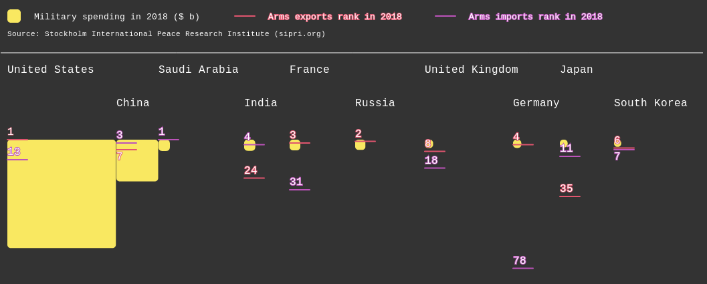

# aux armes

Looking into the top 10 countries in terms of military spending:

- [x] Do they keep those arms to themselves? Export them? Import more?
- [ ] How does this spending compares to other budgets/spendings like education, health, energy...?

